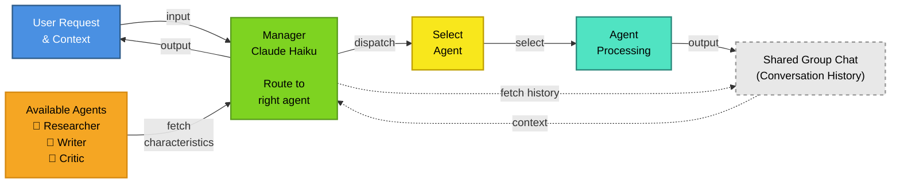

# Use Case: Automating GOV.UK Guidance Content Drafting

This page outlines the use case we have built our agentic swarm around, as well as the architectural approach we've taken. If you're ready to run the reference implementation, see the [Getting Started guide](./reference/README.md).

> [!IMPORTANT]
> This is a reference implementation used as an example of an agentic swarm. However, when running this system in **local development or lower environments**, you **must only use publicly available and/or mocked data sources**. Do not use sensitive, proprietary, or production data in non-production deployments.
>
> For local setup instructions, see [docs/local-development.md](docs/local-development.md).

## Who this document is for?
- Technical stakeholders interested in how agentic swarms can be designed and orchestrated to solve complex tasks
- Developers looking to understand the architectural decisions and design patterns used in the reference implementation
- Product managers and content designers interested in how agentic swarms can be applied to a real-world problem

## The problem

Drafting new guidance content based on policy documents and user needs is a complex and resource-intensive task. It typically involves multiple stages such as:
- Deep reading of numerous policy documents, user needs, and possibly legislation
- Writing in plain English at the right level for the intended audience
- Ensuring the content is compliant with GDS standards and guidelines
- Reviews and iterations to get the content right

This type of work is very rarely conducted by a single individual. Instead, it is typically a collaborative team effort across multiple specialists such as:
- Policy researchers who can understand complex documents and extract key information that users need to know
- Content writers who can translate complex information into clear, accessible language
- Reviewers who can critically evaluate the content and ensure it meets the required standards

Owing to the complexity of the task and the need for multiple specialists, writing new guidance content is often a slow and resource-intensive process.

## The solution: An agentic swarm

We've built a reference implementation that demonstrates how a **swarm** of LLM agents could be designed and orchestrated to take on these specialist roles, working collaboratively without requiring human specialists to be in the loop for every step.

### Design approach

For this implementation, we use what is called a "supervisor-led" swarm pattern. In this pattern the supervisor is intentionally lightweight — it performs minimal reasoning of its own. Its sole responsibility is to orchestrate the workflow by routing tasks to the appropriate agents and mediating interactions between them. The **Manager** agent does not itself do substantive analysis or content generation; it simply ensures the right agent is engaged at the right time and that information flows correctly between them.

This is different from traditional approaches to supervisor-led swarms, where the supervisor often takes on a more active role in reasoning and decision-making. By keeping the supervisor lightweight, we create a more modular and flexible system, where each agent can focus on its specific role without being burdened by the need to understand the entire workflow. This contrasts with a deep-agent design, which tends to have much more centralized reasoning and decision-making within the lead agent.

In this swarm:
- Multiple agents run as distinct roles, each with its own instructions and tools
- The manager orchestrates the conversation and workflow, but does not perform deep reasoning or content generation itself
- Agents all contribute their outputs to a shared group chat (without tool call results) to maintain a common context and reduce the risk of context rot. The manager can refer to this shared context when making decisions about routing and task management, but does not rely on it for deep reasoning or content generation

> [!TIP]
> Context rot is a common issue in LLM-based systems when the context window gets too long, and the model can no longer effectively utilise the full context. This can lead to the model seemingly "forgetting" important information that was provided earlier in the conversation. Having multiple agents all having the same context window will exacerbate this issue, it can also lose the benefit of specialisation. By having a shared group chat that doesn't include information not relevant for other agents, we can help to mitigate this issue and ensure that all agents have access to the most relevant information without overwhelming the context window.

### Swarm diagram

### Agent roles and responsibilities

The entry point into the swarm is through a **Manager** agent, whose role is to orchestrate the workflow and route tasks to the appropriate agents. The Manager is deliberately lightweight:
- No deep reasoning
- No content generation
- Limited tool access (only the `dispatch` tool)

This allows the Manager to focus solely on orchestration, without being burdened by understanding the entire workflow or performing complex reasoning. Sub-agents can be easily swapped out or modified without needing to change the Manager's design.

The swarm consists of three specialist agents:

- **Researcher**: Researches the policy / user needs document(s) uploaded by a user, extracting the key information and providing this to the other members of the swarm.
- **Writer**: Takes the information provided by the Researcher and uses it to generate a first draft of GDS compliant content. Ensures that the content meets the required standards and guidelines.
- **Critic**: Reviews the content generated by the Writer, providing feedback and suggestions for improvement. Has access to the same information as the Writer, but focused on critically evaluating the content against the required standards.

| Agent | Role | Tools |
|---|---|---|
| Manager | Lightweight supervisor / orchestrator — routes tasks, mediates interactions, maintains transcript/context. | <ul><li>`dispatch(agent_name, task)`</li><li>`prompt_repository.get_prompt_by_name`</li><li>`group_chat`</li><li>`run_config`</li><li>`context_history`</li><li>`get_model_for_agent`</li></ul> |
| Researcher | Research & context extraction — finds and fetches policy/user-needs documents. | <ul><li>`list_policy_documents()`</li><li>`get_document_content(context_id)`</li><li>`run_config.context_documents`</li><li>`context_repository`</li></ul> |
| Writer | Content authoring — generate drafts and manage content pages. | <ul><li>`create_page(page_key, content)`</li><li>`update_page(page_key, content)`</li><li>`content_pages_tools`</li><li>`context_documents_toolset`</li><li>`prompt_repository`</li></ul> |
| Critic | Review & feedback — evaluate content and provide suggestions. | <ul><li>`content_pages_tools`</li><li>`context_documents_toolset`</li><li>`prompt_repository`</li></ul> |

### Tech stack

- [Pydantic AI](https://ai.pydantic.dev/) — Framework for building LLM agents with structured tools and repositories
- [Amazon Bedrock](https://aws.amazon.com/bedrock/) — Managed service for foundation models
- [Anthropic Claude](https://www.anthropic.com/claude) — Multiple model variants optimized for different agent roles

#### Agent-to-Model Mapping

| Agent | Model | Rationale |
|-------|-------|-----------|
| Manager | Claude Haiku | Balanced speed & cost for task orchestration |
| Researcher | Claude Haiku | Fast, efficient extraction of structured information |
| Writer | Claude Sonnet | High-quality content generation with nuanced reasoning |
| Critic | Claude Sonnet | Detailed evaluation against complex guidelines |

## What is needed to use it?

- One or more policy documents (text or ideally markdown files) to base the content on
- A clear idea of the intended audience and their needs (e.g. users of a specific service, or users with a specific need)
- A content designer to lead the process and review the outputs, providing feedback and guidance to the swarm as needed

## Further reading

### Reference implementation
The reference implementation (targeted towards developers) for this use case can be found in the [GOV.UK Guidance Content Swarm](https://github.com/DEFRA/ai-uc-content-swarm)

### Proof of concepts
Before building the pattern and the use case, we built a number of proof of concepts to test different aspects of the design. PoCs for this use case are as follows:
- [ai-agent-swarm-spike](https://github.com/DEFRA/ai-spike-agent-swarm)

### Tech Patterns Used

This use case is built upon the following technical patterns:
- [Async LLM Inference](https://github.com/DEFRA/ai-tech-pattern-async-inference)
- [AI Frameworks](https://github.com/DEFRA/ai-tech-pattern-ai-frameworks)
