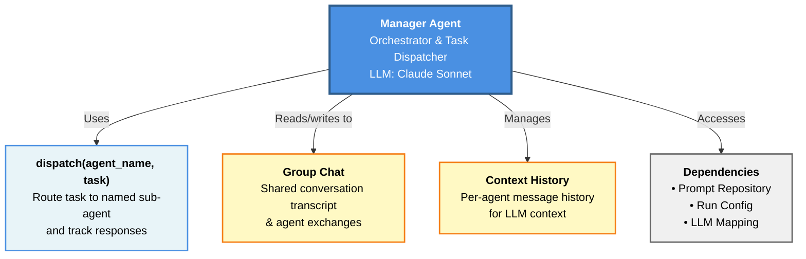
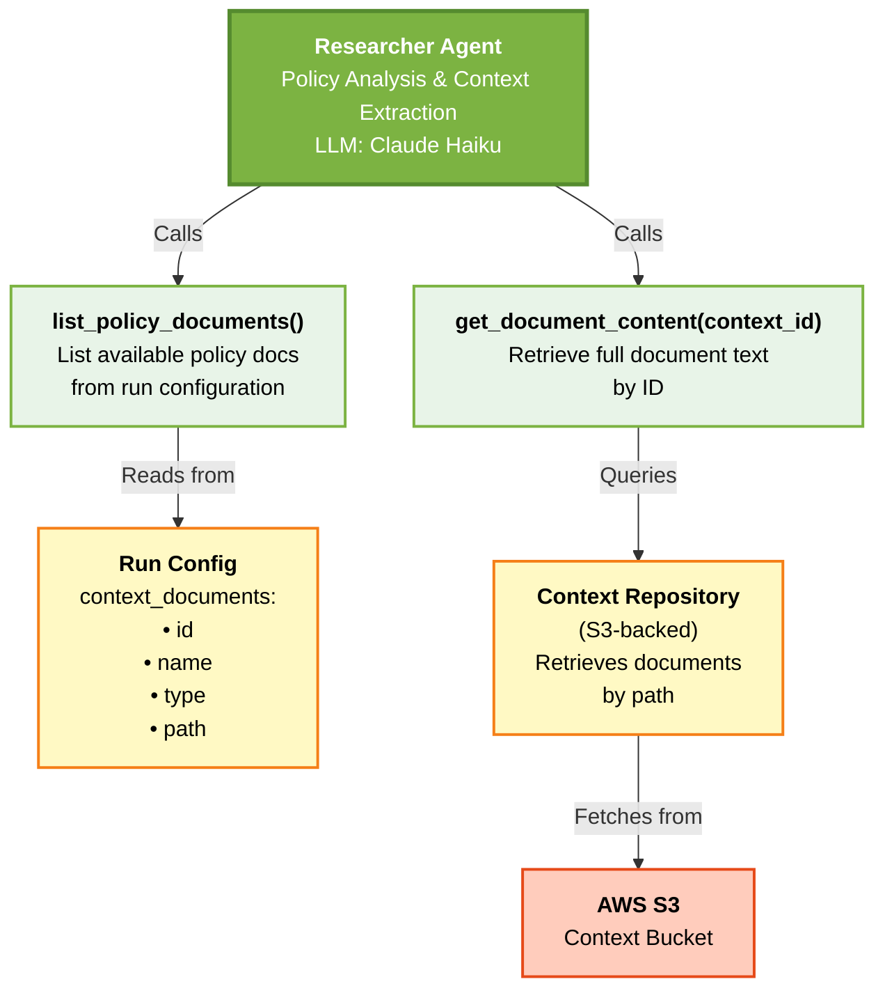
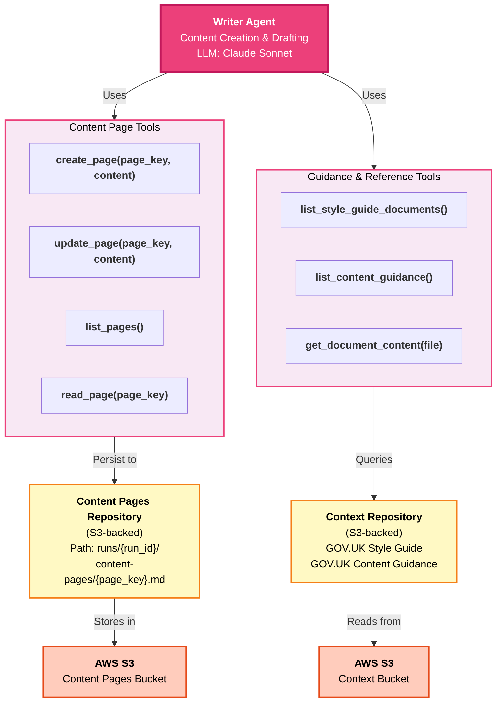
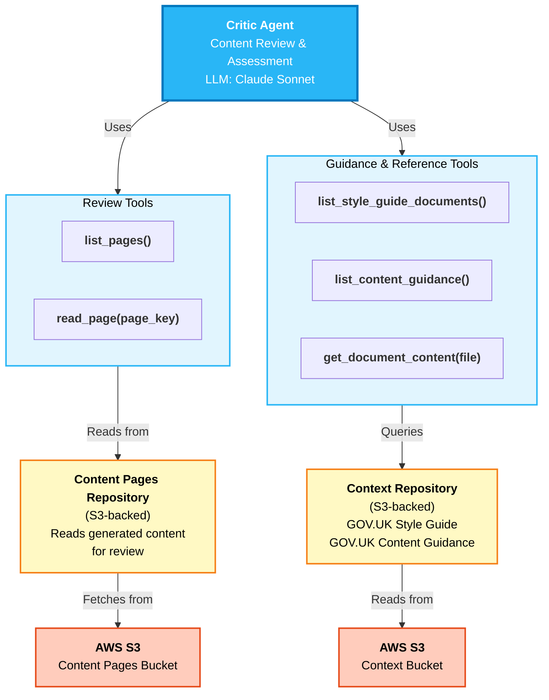

# Agent Architecture

This document provides zoomed-in architecture diagrams for each agent in the content swarm, showing the tools available to each agent, the services and repositories they interact with, and the underlying infrastructure.

See also: [Context Types](context-types.md) for a breakdown of the data each agent works with.

---

## Manager Agent

The orchestrator and entry point for the swarm. Routes tasks to appropriate sub-agents and maintains the shared conversation context.

**Key characteristics:**
- Single tool: `dispatch` — delegates all substantive work to sub-agents
- Maintains the shared group chat transcript for context across agent turns
- Tracks per-agent message history to manage LLM context windows
- No direct access to content pages, policy documents, or style guides

---

## Researcher Agent

Analyzes uploaded policy documents and extracts key information needed by other agents.

**Key characteristics:**
- Read-only access to policy documents provided at run time via the SQS job payload
- Uses Claude Haiku — suited to structured information extraction at lower cost
- No access to content creation or GOV.UK style/guidance documents
- Output flows to other agents via the shared group chat

---

## Writer Agent

Generates initial content drafts based on researcher insights and GOV.UK guidelines.

**Key characteristics:**
- Full content lifecycle: create and update pages (Critic has read-only)
- Supports multiple pages per run: a `main` page plus optional `sub/<slug>` pages
- Real-time access to GOV.UK style guides and content guidance during drafting
- All created/updated content is persisted immediately to S3

---

## Critic Agent

Reviews generated content against GOV.UK guidelines and provides improvement feedback.

**Key characteristics:**
- Read-only access to content pages — cannot create or modify content directly
- Same guidance toolset as the Writer, enabling independent standards verification
- Feedback is returned as output to the group chat for the Writer to act on
- Uses Claude Sonnet for nuanced quality evaluation

---

## Infrastructure & Data Storage

All agents interact with three core service repositories:

| Repository | Backed By | Purpose | Writer | Critic | Researcher | Manager |
|---|---|---|:---:|:---:|:---:|:---:|
| **Content Pages** | AWS S3 | Stores generated markdown content | Read/Write | Read | — | — |
| **Context** | AWS S3 | Style guides, content guidance, policy docs | Read | Read | Read | — |
| **Prompts** | Filesystem | Agent system instructions | Read | Read | Read | Read |

S3 object path for content pages: `runs/{run_id}/content-pages/{page_key}.md`
