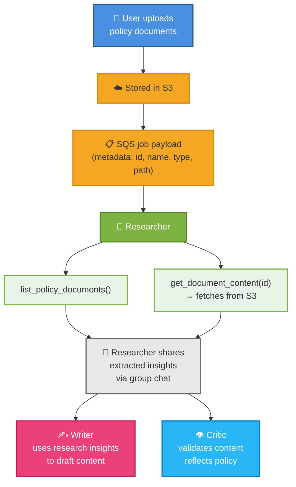
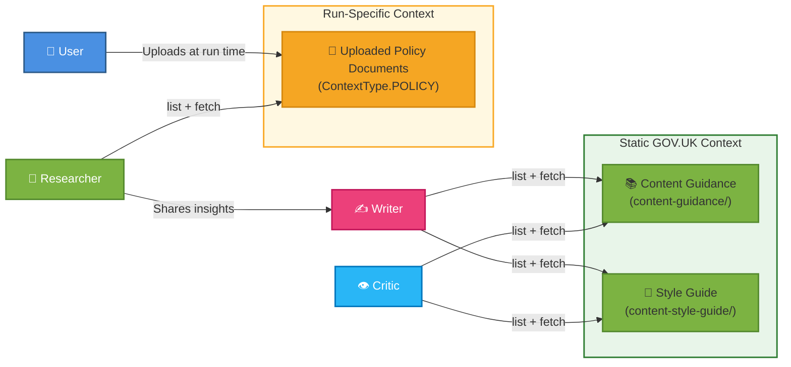

# Context Types

The agents in the content swarm work with three distinct categories of context. Understanding what each is, where it lives, and which agents can access it is key to understanding how the swarm produces compliant GOV.UK content.

See also: [Agent Architecture](agent-architecture.md) for how each agent uses these context types.

---

## 1. GOV.UK Style Guide

**Purpose:** Technical writing standards for GOV.UK content — grammar, formatting, terminology, and style rules.

**Stored in:** S3 Context Bucket  
**Accessed via:** `list_style_guide_documents()` → `get_document_content(file)`  
**Index path:** `content-style-guide/index.json`

### Contents

| Category | Examples |
|----------|----------|
| **Technical Rules** (30+ rules) | Abbreviations & acronyms, capitalisation, dates, hyphenation, money, numbers, times, lists, legal content |
| **A–Z Definitions** (26 entries) | Alphabetical terminology standards and preferred terms for government services |
| **Sensitive Terminology** | Words to avoid, ethnic minorities, geography & regions, names and personal titles |

### Example documents

- `a-to-z/rules/abbreviations-acronyms-and-initialisms.md` — How to write acronyms correctly
- `a-to-z/rules/bullet-points-and-steps.md` — When and how to use lists and steps
- `a-to-z/rules/capitalisation.md` — GOV.UK capitalisation standards
- `a-to-z/rules/legal-content.md` — How to format legal references
- `a-to-z/rules/words-to-avoid.md` — Jargon and non-plain-English terms to avoid
- `technical-content-a-to-z.md` — Full technical A–Z reference

### Agent access

| Agent | Access | Purpose |
|-------|:------:|---------|
| Writer | ✅ | References style rules while drafting to ensure consistent formatting and language |
| Critic | ✅ | Validates generated content against style rules |
| Researcher | ❌ | Not relevant to policy extraction |
| Manager | ❌ | Orchestration only |

---

## 2. GOV.UK Content Guidance

**Purpose:** Strategic content design guidance — how to plan, structure, type, and publish GOV.UK content.

**Stored in:** S3 Context Bucket  
**Accessed via:** `list_content_guidance()` → `get_document_content(file)`  
**Index path:** `content-guidance/index.json`

### Contents

| Category | Examples |
|----------|----------|
| **Content Strategy** | What is content design?, Planning content, User needs, Helping users prepare for change |
| **Writing Standards** | Writing for GOV.UK, Welsh language on GOV.UK, Research and evidence |
| **Content Organisation** | Organising and grouping content, URL standards, Links, Tables, Images |
| **Content Types** (60+ formats) | Guides, manuals, news articles, publications, statistics, consultations, speeches, case studies |
| **Special Circumstances** | Pre-election publishing, Royal death event publishing, Campaigns and logos |

### Example documents

- `writing-for-gov-uk.md` — How to write clearly for diverse audiences, including specialists
- `user-needs.md` — Recording and defining user needs for content
- `planning-content.md` — Content lifecycle and accessibility planning
- `content-types/detailed-guide.md` — When to use a detailed guide format
- `content-types/publication-statutory-guidance.md` — Publishing statutory guidance
- `guidance-for-publishing-on-gov-uk-during-the-pre-election-period.md` — Election period rules

### Agent access

| Agent | Access | Purpose |
|-------|:------:|---------|
| Writer | ✅ | Guides content structure, tone, and format selection while drafting |
| Critic | ✅ | Validates content strategy and format choices are appropriate |
| Researcher | ❌ | Focused on policy documents, not GOV.UK publishing guidance |
| Manager | ❌ | Orchestration only |

---

## 3. User-Uploaded Policy Documents

**Purpose:** Domain-specific policy documents, requirements, and user needs provided for a particular content generation run. These are use-case specific and unique to each run.

**Stored in:** S3 Context Bucket  
**Accessed via:** `list_policy_documents()` → `get_document_content(context_id)` (fetches from S3)  
**Provided at:** Run start via SQS job payload (contains document metadata: id, name, type, and S3 path)

### Characteristics

| Aspect | Details |
|--------|---------|
| **Source** | Uploaded by the user before invoking the swarm; stored in S3 |
| **SQS Payload** | Contains document metadata (id, name, type, S3 path) — not the full documents |
| **Type** | Always `ContextType.POLICY` in the run configuration |
| **Lifecycle** | Scoped to a single run — unique per content generation task |
| **Fetch Pattern** | Researcher calls `get_document_content(context_id)` → fetches full content from S3 by path |
| **Examples** | Policy papers, legislation summaries, user research reports, service design briefs |

### How documents flow through the swarm

### Agent access

| Agent | Access | Purpose |
|-------|:------:|---------|
| Researcher | ✅ Direct | Lists, retrieves, and extracts from all uploaded policy documents |
| Writer | ✅ Indirect | Consumes Researcher's insights from the group chat |
| Critic | ✅ Indirect | Reviews generated content for alignment with policy via group chat context |
| Manager | ❌ | Delegates policy research to the Researcher |

---

## Context Interaction Flow

---

## Storage & Retrieval Summary

All three categories live in the same S3 Context Bucket, retrieved on-demand during agent execution:

| Context Type | Metadata Storage | List Tool | Fetch Tool |
|---|---|---|---|
| GOV.UK Content Guidance | `content-guidance/index.json` (in S3) | `list_content_guidance()` | `get_document_content(file)` |
| GOV.UK Style Guide | `content-style-guide/index.json` (in S3) | `list_style_guide_documents()` | `get_document_content(file)` |
| User Policy Documents | SQS job payload (path metadata only) | `list_policy_documents()` | `get_document_content(context_id)` fetches from S3 |

Retrieval is async and on-demand — agents only fetch what they need. The SQS payload contains document metadata (id, name, type, path), but the full documents are always fetched from S3, keeping memory footprint lean.
